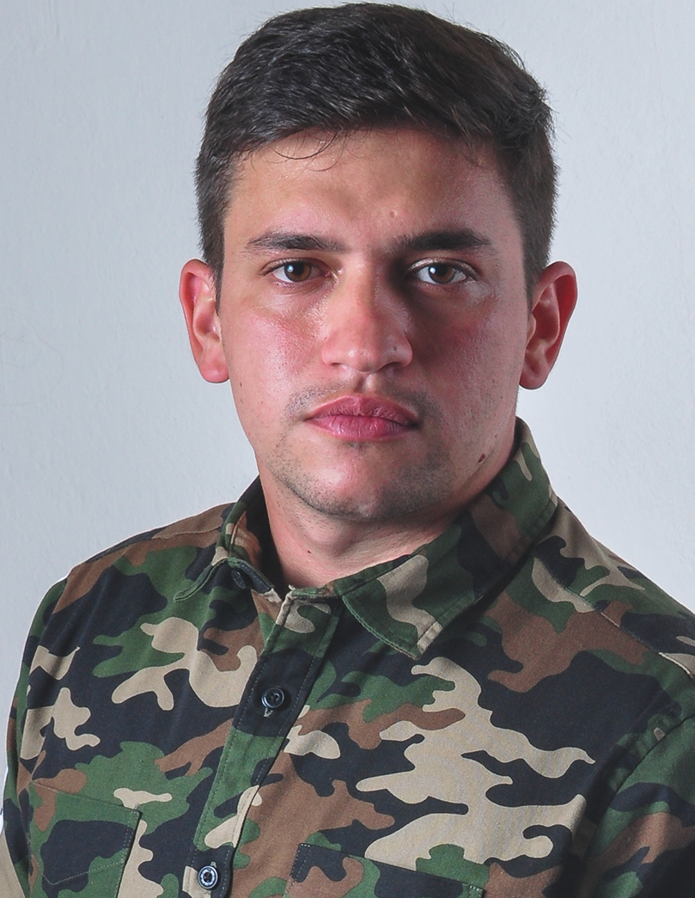

# 💻 #boracodar - Calculadora

[🚀 Acesse aqui]()

## 💻 O desafio

O desafio 5 é um layout de uma calculadora.

No desafio não precisava deixar funcional porém resolvi deixa-la funcional.

## 🎨 Layout do projeto

Este é o <a href="https://www.figma.com/community/file/1202607074523509182">layout do projeto</a> no Figma.

## 🛠 Tecnologias

- HTML
- CSS
- Javascript
- Figma
- Git
- GitHub

<table>
  <tr>
    <td>
     
    </td>
    <td>
      Feito por Gleidson Queiroz.</a> 🙋🏼‍♂️
    </td>
  </tr>
</table>
